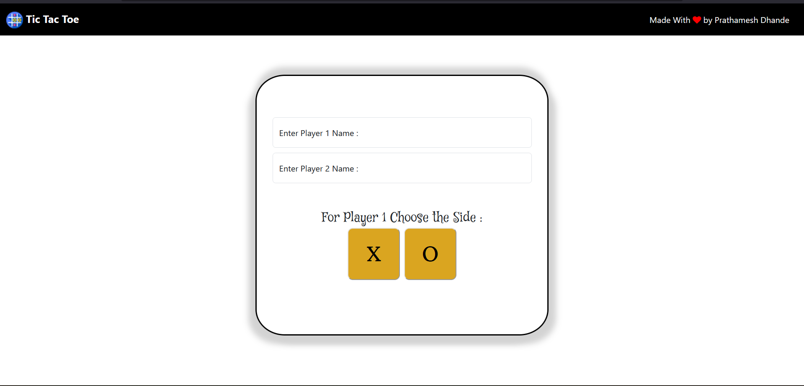
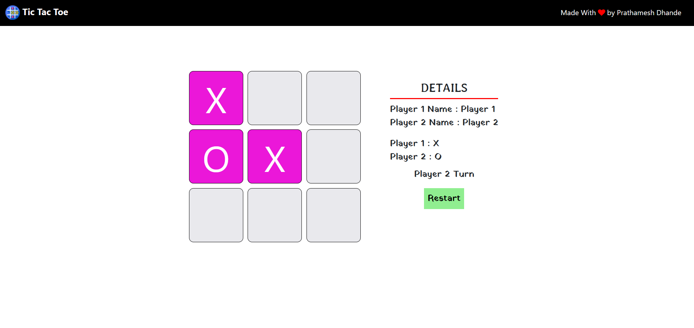
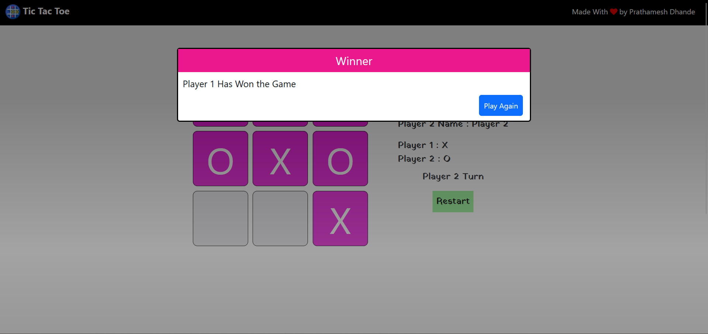

# Tic Tac Toe Game 

This project is the part of the Web Development tutorial.

This is a simple Tic Tac Toe game built using JavaScript. The game can be played in a web browser and is designed to be simple and intuitive.

## Features :
The game has the following features:

- Two players can play the game.
- Players take turns to place their mark (either "X" or "O") on the game board.
- The first player to get three marks in a row (horizontally, vertically, or diagonally) wins the game.
- If no player gets three marks in a row and the game board is full, the game ends in a tie.

## Technologies Used :
The Tic Tac Toe game was built using the following technologies:
1. HTML
2. CSS
3. JavaScript

## Screenshots :
1. HomePage of the Game

2. Game Screen

3. Winner Screen

## Credits :
This Tic Tac Toe game was created by Prathamesh Dhande.

## Author : Prathamesh Dhande